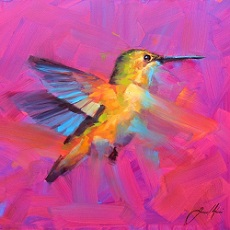
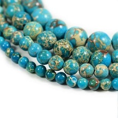
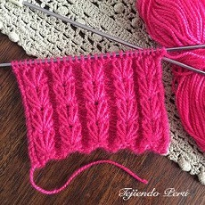

# Proyecto_Semestral
Proyecto PGY3121 - 002D Lucas Aguirre, David Romero y Sebastián Contreras
Caso a desarrollar  "Caso 1 Cooperativa artística Ground Zero"

<!DOCTYPE html>
<html lang="en">
<head>
    <meta charset="UTF-8">
    <meta http-equiv="X-UA-Compatible" content="IE=edge">
    <meta name="viewport" content="width=device-width, initial-scale=1.0">
    <title>Grupo cero</title>
    <link rel="stylesheet" href="css/bootstrap.css">
    <link rel="stylesheet" href="css/estilos.css">
</head>
<body>
    
    

        

            <section id="logo">
                

            </section>
            

                <ul class="nav justify-content-end">
                    <li class="nav-item">
                      <a class="nav-link active" href="iniciosesion.html">Inicio Sesión</a>
                    </li>
                    <li class="nav-item">
                      <a class="nav-link" href="registrarse.html">Crear Cuenta</a>
                    </li>
                  </ul>

            

        

        

            

                

                    <h1 class="titulo">Grupo Cero</h1>
                    
Grupo de ventas de articulos de Arte General

                    

                    <form class="d-flex">
                        <input class="form-control me-2" type="search" placeholder="Buscar por Nombre de Artista, Tipo de Arte o Concepto..." aria-label="search">
                        <button class="btn btn-outline-success" type="submit">Buscar</button>
                      </form>
                    

                  

                </nav>
                  

        

        

        

            

            

                

                  

                      
                    

                        <h5 class="card-title">Pinturas</h5>
                        <a class="btn btn-primary btn-lg" href="#" role="button">Revisa nuestra galería aquí</a>
                    

                  

                

            

            
              

            

                

                  

                      
                      

                        <h5 class="card-title">Orfebrería</h5>
                      <a class="btn btn-primary btn-lg" href="#" role="button">Revisa nuestra galería aquí</a>
                    

                  

                

              

            

            

                

                  

                      
                      

                        <h5 class="card-title">Tejidos</h5>
                      <a class="btn btn-primary btn-lg" href="#" role="button">Revisa nuestra galería aquí</a>
                    

                  

                

              

            

            

                

                  

                      
                       

                        <h5 class="card-title">Manualidades</h5>
                      <a class="btn btn-primary btn-lg" href="#" role="button">Revisa nuestra galería aquí</a>
                    

                  

                

              

        

    
  
    

    <footer class="foterpie">
        <!-- Grid container -->
        

          <!--Grid row-->
          

            <!--Grid column-->
            

              <h5 class="text-uppercase">Más Información</h5>
              <a class="btn btn-primary btn-lg" href="#" 
            role="button">Conócenos</a>

              

            Para más información haz click aquí
              

            

            <!--Grid column-->

    
    
    
</body>

</html>
